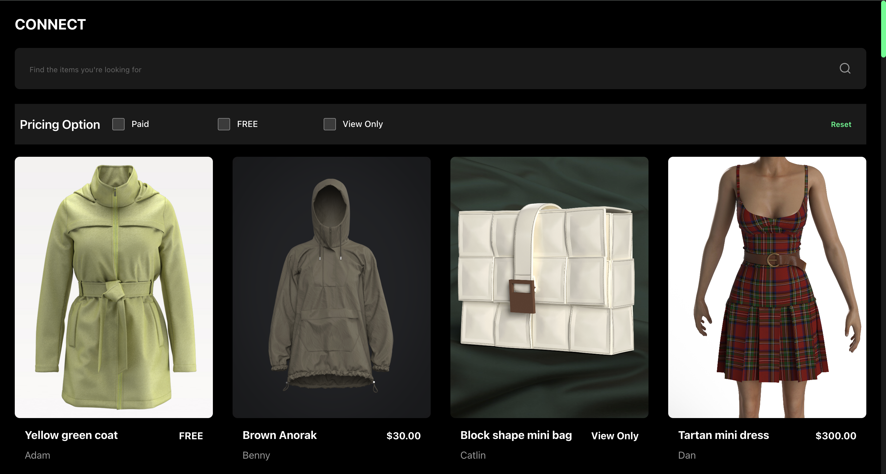

# Content List Application



A modern React application for browsing and filtering content items with search functionality. Built with React, TypeScript, Redux Toolkit, and Vite.

## 📋 Table of Contents

- [Features](#features)
- [Tech Stack](#tech-stack)
- [Project Structure](#project-structure)
- [Getting Started](#getting-started)
- [Available Scripts](#available-scripts)
- [API Integration](#api-integration)
- [State Management](#state-management)
- [Code Quality](#code-quality)
- [Testing](#testing)
- [Build & Deployment](#build--deployment)

## ✨ Features

- **Content Browsing**: View a list of content items with details (title, creator, price, image)
- **Search Functionality**: Real-time search across content items
- **Filter by Pricing**: Filter content by pricing status (Free, Paid, View Only)
- **Loading States**: Proper loading indicators during API calls
- **Error Handling**: Comprehensive error handling with retry functionality
- **Responsive Design**: Modern, responsive UI built with SCSS
- **Type Safety**: Fully typed with TypeScript
- **Internationalization**: Ready for i18n support

## 🚀 Tech Stack

### Core Dependencies

- **React 18.2** - UI library
- **TypeScript 5.9** - Type safety
- **Redux Toolkit 2.9** - State management
- **Axios 1.12** - HTTP client
- **React Redux 9.1** - Redux React bindings
- **i18next 25.6** - Internationalization
- **Vite 5.2** - Build tool

### Development Tools

- **ESLint** - Code linting
- **Prettier** - Code formatting
- **Jest** - Testing framework
- **Testing Library** - Component testing
- **Husky** - Git hooks
- **SCSS** - Styling

## 📁 Project Structure

```
clo/
├── public/              # Static assets
├── src/
│   ├── components/     # React components
│   │   ├── ContentsList/
│   │   ├── FilterSection/
│   │   ├── Header/
│   │   ├── ItemCard/
│   │   └── SearchBar/
│   ├── constants/      # Application constants
│   │   └── api.constants.ts
│   ├── hooks/          # Custom React hooks
│   │   └── useContent.ts
│   ├── locales/        # i18n translations
│   ├── services/       # API service layer
│   │   └── api.service.ts
│   ├── store/          # Redux store
│   │   ├── slices/
│   │   │   └── contentSlice.ts
│   │   └── store.ts
│   ├── styles/         # Global styles
│   ├── utils/          # Utility functions
│   ├── App.tsx         # Root component
│   └── main.tsx        # Entry point
├── .husky/            # Git hooks
├── coverage/          # Test coverage reports
├── dist/              # Build output
└── node_modules/      # Dependencies
```

## 🛠️ Getting Started

### Prerequisites

- **Node.js** (v16 or higher)
- **npm** or **yarn** or **pnpm**

### Installation

1. **Clone the repository**

   ```bash
   git clone <repository-url>
   cd clo
   ```

2. **Install dependencies**

   ```bash
   yarn install
   # or
   npm install
   ```

3. **Start the development server**

   ```bash
   yarn dev
   # or
   npm run dev
   ```

4. **Open your browser**
   Navigate to `http://localhost:5173` (or the port shown in your terminal)

## 📜 Available Scripts

| Script               | Description               |
| -------------------- | ------------------------- |
| `yarn dev`           | Start development server  |
| `yarn build`         | Build for production      |
| `yarn preview`       | Preview production build  |
| `yarn test`          | Run tests                 |
| `yarn test:watch`    | Run tests in watch mode   |
| `yarn test:coverage` | Run tests with coverage   |
| `yarn lint`          | Lint code                 |
| `yarn lint:fix`      | Lint and fix code         |
| `yarn format`        | Format code with Prettier |
| `yarn format:check`  | Check code formatting     |

## 🔌 API Integration

### API Service Architecture

The application uses a centralized API service pattern with the `makeApiCall` function located in `src/services/api.service.ts`.

#### Key Features

- **Centralized HTTP Client**: All API calls go through `makeApiCall`
- **Type Safety**: Full TypeScript support with generics
- **Consistent Response Format**: All responses follow `IApiResponse<T>` interface
- **Error Handling**: Comprehensive error handling and transformation
- **Authentication Ready**: Bearer token authentication support

## 🧪 Testing

### Running Tests

```bash
# Run all tests
yarn test

# Run tests in watch mode
yarn test:watch

# Run tests with coverage
yarn test:coverage
```

### Test Structure

Tests are located alongside components:

- `*.test.tsx` - Component tests
- `__mocks__/` - Mock files
- `setupTests.ts` - Test configuration

### Coverage

View coverage reports in the `coverage/` directory or open `coverage/lcov-report/index.html` in your browser.

## 📐 Code Quality

### Linting & Formatting

- **ESLint**: Configured for React and TypeScript
- **Prettier**: Automatic code formatting
- **Husky**: Git hooks for pre-commit checks
- **lint-staged**: Run linting on staged files

### Pre-commit Hooks

The project includes pre-commit hooks that run:

- ESLint (with auto-fix)
- Prettier (formatting)
- Type checking

## 🏗️ Build & Deployment

### Production Build

```bash
yarn build
```

This creates an optimized production build in the `dist/` directory.

### Preview Production Build

```bash
yarn preview
```

### Deployment

The application can be deployed to any static hosting service:

- **Vercel**
- **Netlify**
- **GitHub Pages**
- **AWS S3 + CloudFront**

## 📝 Code Style

### TypeScript

- Strict type checking enabled
- Full type coverage for all components
- Consistent use of interfaces and types

### React Patterns

- Functional components with hooks
- Custom hooks for reusable logic
- Component composition
- Props interface definitions

### Styling

- SCSS modules for component styles
- BEM naming convention
- Responsive design patterns
- CSS variables for theming

## 🌍 Internationalization

The application is prepared for internationalization using `i18next`:

- Translation files in `src/locales/`
- Support for multiple languages
- Ready to add new translations

## 🤝 Contributing

1. Create a feature branch
2. Make your changes
3. Run tests and linting
4. Commit your changes (pre-commit hooks will run)
5. Push to your branch
6. Create a Pull Request

### Git Hooks

Pre-commit hooks automatically:

- Format code with Prettier
- Lint code with ESLint
- Run tests on affected files
